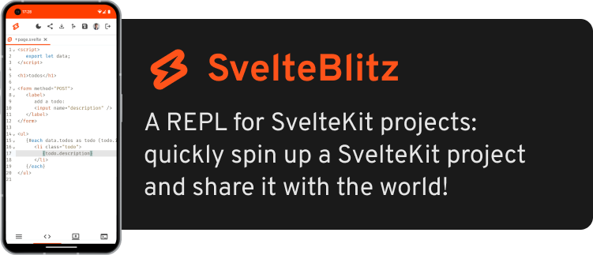

[](https://www.sveltelab.dev/)

---

**✨ Features:**

- 🌗 Light / Dark Mode
- 🚨 TypeScript Errors
- 🎨 Command Palette: <kbd>Ctrl / CMD</kbd> + <kbd>Shift</kbd> + <kbd>P</kbd>
- 🧹 Code Formatting
- 📒 Templates (TypeScript, Tailwind, mdsvex)
- 📄 SvelteKit File Icons
- 🛤️ SvelteKit Route Generation
- ➕ [Svelte Add](https://github.com/svelte-add/svelte-add) integration
- 📦 Install Packages
- ⌨️ Vim Keybindings
- 👻 Hide Config Clutter (show file tree from `/src`)
- 💌 Share Code via Hash or Share Project via ID
- 🐙 Import from GitHub
- 📦 Download Projects
- 💻 [CLI](https://www.npmjs.com/package/sveltelab)
- 🔧 Editor Preferences

🧡 Made with Svelte, for Svelte, by Svelte lovers!

🔌 Powered by SvelteKit, WebContainers, CodeMirror, Xterm.js and PocketBase

---

[🧪 Try it out now on sveltelab.dev!](https://sveltelab.dev/)

[ Read the Docs](http://docs.sveltelab.dev/)

[ Create an Issue](https://github.com/sveltelab/sveltelab/issues/new/choose)

[ Join the Discord](https://discord.gg/FbnT6wujQx)

 Twitter: [@PaoloRicciuti](https://twitter.com/PaoloRicciuti), [@SarcevicAntonio](https://twitter.com/SarcevicAntonio)

---

# Development

default branch is now `main` if you have a local `master` branch you can update it like this:

```
git branch -m master main
git fetch origin
git branch -u origin/main main
git remote set-head origin -a
```

1. download [fitting pocketbase binary](https://pocketbase.io/docs/) and place in root
1. `cp .env.sample .env`
1. `pnpm i`
1. `pnpm dev`
1. go to http://127.0.0.1:8090/_/ and setup your PocketBase Admin
